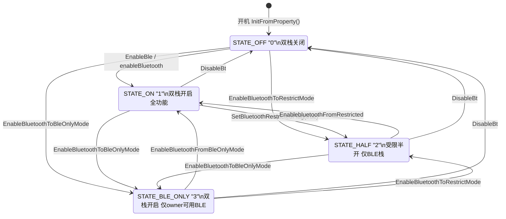
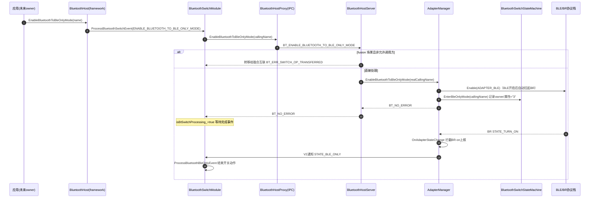
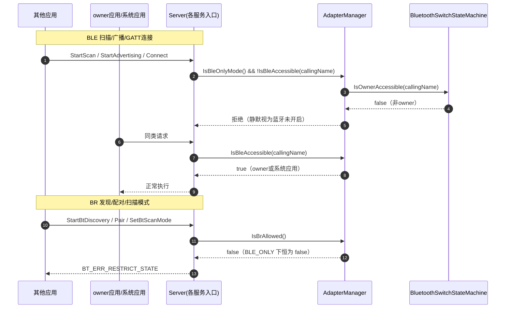
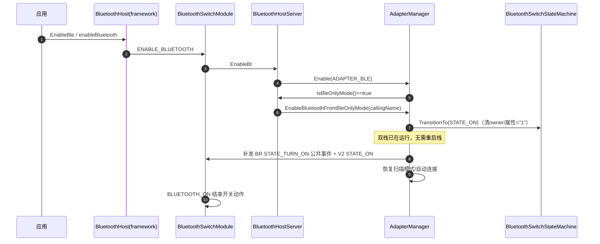

# 蓝牙开关四态（STATE_BLE_ONLY）设计文档

| 项目 | 内容 |
| --- | --- |
| 主题 | 蓝牙开关三态扩展为四态，新增 BLE_ONLY（应用专属 BLE）态 |
| 状态 | 已实现 |
| 涉及模块 | service(common)、server、ipc、frameworks/inner、interfaces/inner_api |

## 1. 背景与需求

蓝牙开关原有三态：

| 状态 | 属性值 | 含义 |
| --- | --- | --- |
| STATE_ON | `persist.bluetooth.switch_enable = "1"` | BLE + BR 双栈开启，全部功能可用 |
| STATE_OFF | `"0"` | 双栈关闭 |
| STATE_HALF | `"2"` | 受限半开：仅 BLE 开启，BR 对上层隐藏 |

新增第四态 **STATE_BLE_ONLY**（属性值 `"3"`）：

- 底层 BLE、BR 双栈**均保持开启**（便于快速切回全开，不重启协议栈）；
- 对上层**仅放行 BLE 功能**，BR 的发现/配对/连接对所有应用一律拒绝；
- BLE 功能仅允许"打开蓝牙的应用"（owner，记录调用方包名）及系统应用使用，其他应用静默视为蓝牙关闭。

## 2. 状态机设计

状态机集中在独立文件中管理：

- 头文件：`services/bluetooth/service/include/bluetooth_switch_state_machine.h`
- 实现：`services/bluetooth/service/src/common/bluetooth_switch_state_machine.cpp`
- 类：`BluetoothSwitchStateMachine`（单例）

### 2.1 状态机图

说明：

- 迁移合法性由内置迁移表校验，非法迁移打 HILOG 并返回 `BT_ERR_INVALID_STATE`；
- owner 记录于 `persist.bluetooth.ble_only_owner`，离开 BLE_ONLY 即清除；
- `SyncState()` 仅更新内存态不落盘，用于 disable 路径（属性 "0" 由双栈全关时的卸载流程写入）。

### 2.2 主要接口

| 接口 | 说明 |
| --- | --- |
| `TransitionTo(target)` | 合法迁移 + 持久化 |
| `EnterBleOnlyMode(ownerName)` | 进入 BLE_ONLY 并记录 owner |
| `SyncState(state)` | 仅内存同步，不落盘 |
| `InitFromProperty()` | 重启恢复状态与 owner |
| `IsBleOnlyMode() / IsBluetoothRestricted()` | 状态查询 |
| `IsOwnerAccessible(callingName)` | owner 匹配判断（不含系统应用放行） |
| `IsBrAllowed()` | BR 功能是否放行（仅 BLE_ONLY 为 false） |

`AdapterManager` 对外封装 `IsBleAccessible(callingName) = IsSystemHap() || IsOwnerAccessible(callingName)`，状态机本身不依赖 PermissionManager，便于独立单测。

## 3. 关键时序图

### 3.1 进入 BLE_ONLY（从全关）

### 3.2 BLE_ONLY 下功能鉴权

### 3.3 BLE_ONLY 升级为全开

## 4. 代码改动清单

| 层 | 文件 | 改动 |
| --- | --- | --- |
| 公共定义 | `frameworks/inner/ipc/common/bt_def.h` | `BluetoothSwitchState` 新增 `STATE_BLE_ONLY`；`BluetoothTransferredSwitchAction` 新增 `TRANS_ACTION_ENABLE_BLUETOOTH_TO_BLE_ONLY_MODE` |
| 状态机 | `services/bluetooth/service/include/bluetooth_switch_state_machine.h`、`src/common/bluetooth_switch_state_machine.cpp` | 新增四态状态机（独立文件） |
| service | `adapter_manager.{h,cpp}`、`interface_adapter_manager.h` | `EnableBluetoothToBleOnlyMode` / `EnableBluetoothFromBleOnlyMode` / `IsBleOnlyMode` / `IsBleAccessible` / `IsBrAllowed`；`OnAdapterStateChange` 拦截 BR-on 上报改发 STATE_BLE_ONLY；`Initialize` 重启恢复；restrict 标志同步走状态机 |
| 功能拦截 | `classic_adapter.cpp`、`bluetooth_ble_central_manager_server.cpp`、`bluetooth_ble_advertiser_server.cpp`、`gatt_client_service.cpp` | BR 全禁 + BLE owner 鉴权 |
| IPC | `bluetooth_service_ipc_interface_code.h`、`i_bluetooth_host.h`、`bluetooth_host_proxy.{h,cpp}`、`bluetooth_host_stub.{h,cpp}` | 新增 `BT_ENABLE_BLUETOOTH_TO_BLE_ONLY_MODE` 接口码及代理/桩 |
| server | `bluetooth_host_server.{h,cpp}` | 服务端接口 + fusion 转移 + `GetBtState` 可见性控制 + `EnableBt` 升级路径 |
| framework | `bluetooth_switch_module.{h,cpp}`、`bluetooth_host.cpp`、`interfaces/inner_api/include/bluetooth_host.h` | SwitchModule 新增事件/缓存重放规则；`BluetoothHost::EnableBluetoothToBleOnlyMode` 内部 API |
| 测试 | `test/unittest/inner/bluetooth_switch_state_machine_test.cpp`、`BUILD.gn` | 状态机单测（迁移表/owner 鉴权/重启恢复/属性映射） |

## 5. 状态可见性矩阵

| 调用方 | STATE_ON | STATE_HALF | STATE_BLE_ONLY |
| --- | --- | --- | --- |
| 系统应用 | ON | BLE ON | BLE ON |
| owner 应用 | ON | OFF（弹框流程） | BLE ON |
| 其他三方应用 | ON | OFF | OFF（静默） |

## 6. 验证方式

- 单测：`bluetooth_switch_state_machine_test`
- 编译：`hb build bluetooth -i`
- 手工用例：三方应用 A 调 `EnableBluetoothToBleOnlyMode` → A 可扫描/GATT，B 扫描/广播/GATT 失败且 `getBtState` 为 OFF；A 或设置开蓝牙 → 全开；重启后 BLE_ONLY 与 owner 恢复。
