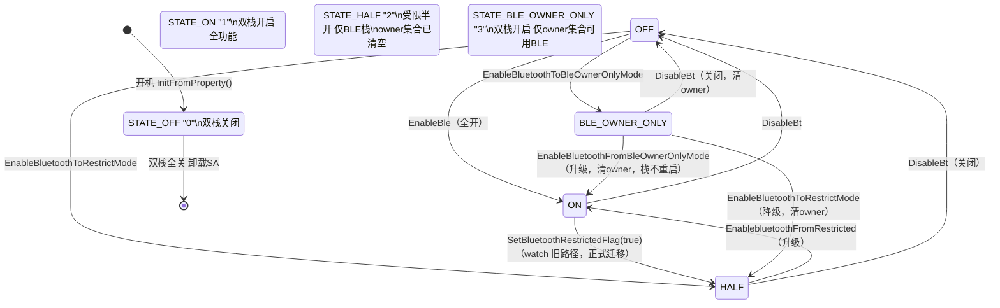
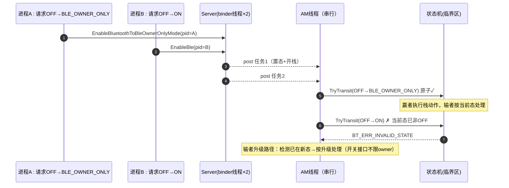
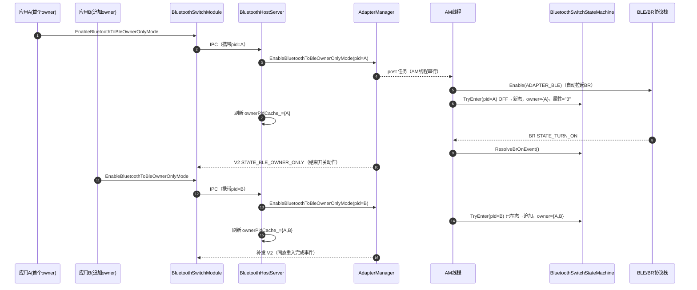
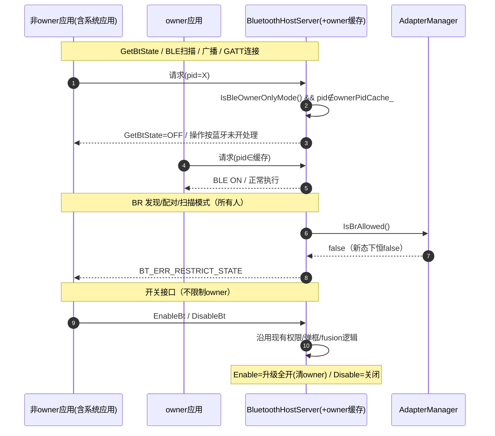
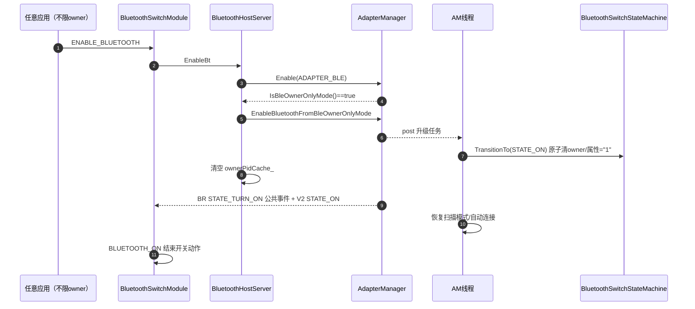
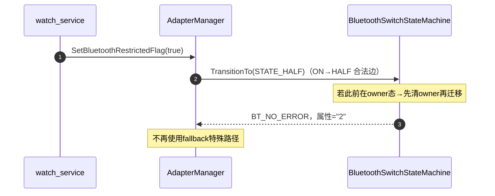

# 蓝牙开关四态（STATE_BLE_OWNER_ONLY）开发设计文档

| 项目 | 内容 |
| --- | --- |
| 主题 | 蓝牙开关三态扩展为四态，新增 BLE_OWNER_ONLY（owner 专属 BLE）态 |
| 版本 | v3.0 |
| 涉及模块 | service(common)、server、ipc、frameworks/inner、interfaces/inner_api |

## 1. 需求与语义

现有三态：`STATE_ON`("1")、`STATE_OFF`("0")、`STATE_HALF`("2")。新增 **`STATE_BLE_OWNER_ONLY`**（属性值 `"3"`）：

- 底层 BLE+BR **双栈均保持开启**（升级全开不重启栈）；
- owner 以 **PID 标识**，支持**多个 owner**（集合）；仅 owner 集合内的调用方可见 BLE ON 并可使用 BLE；
- 其他应用（含系统应用）`GetBtState=OFF`，扫描/广播/GATT 静默按蓝牙未开处理；
- BR 功能对该态下所有人拒绝；
- **蓝牙打开/关闭开关接口不限制 owner**：任何应用可照常调 Enable/Disable（沿用现有权限/弹框/fusion 逻辑）——新态下非 owner 调 Enable 即升级全开，调 Disable 即关闭；仅 BLE 使用类接口与状态可见性做 owner 鉴权；
- owner 集合**仅在 BLE_OWNER_ONLY 态存在**，离开该态（升级/关闭/降级 HALF）即全部清空，不存在"HALF 态下的 owner"。

## 2. 状态机设计

独立文件：`services/bluetooth/service/include/bluetooth_switch_state_machine.h` + `src/common/bluetooth_switch_state_machine.cpp`，单例 `BluetoothSwitchStateMachine`。

### 2.1 状态机图（10 条合法边，watch 适配）

- 禁止迁移：ON→BLE_OWNER_ONLY、HALF→BLE_OWNER_ONLY（owner 态只能从 OFF 进入）；
- 同态幂等：BLE_OWNER_ONLY 重入 = 追加 owner；
- 非法迁移返回 `BT_ERR_INVALID_STATE` 并打 HILOG；
- `SyncState()` 仅内存同步（disable 路径专用，属性 "0" 由卸载流程写）；
- **watch 适配**：`SetBluetoothRestrictedFlag(true/false)` 改走状态机正式迁移（ON→HALF 合法化），删除 fallback 特殊路径。

### 2.2 owner 集合设计（PID 标识，多 owner）

| 项 | 设计 |
| --- | --- |
| 标识 | 调用方 PID（`IPCSkeleton::GetCallingPid()`，由 server 层取） |
| 集合 | `std::set<pid_t> ownerPids_`，上限 `MAX_OWNERS = 8`（超出拒绝并打日志） |
| 加入 | `TryEnterBleOwnerOnlyMode(pid)`：OFF→新态建立集合并加入首个 owner；已在态中→追加该 PID |
| 清空 | 离开该态（→ON / →OFF / →HALF）原子清空集合；进入 HALF 前必清 |
| 持久化 | **PID 集合不持久化**（重启后 PID 失效）。属性 "3" 持久化用于重启恢复双栈；恢复时 owner 集合为空 → BLE 全拒（fail-safe），任一应用重新调用进入接口追加自己即可 |

### 2.3 server 侧 owner 缓存

`BluetoothHostServer` 维护 `ownerPidCache_`（进程内副本）：

- 刷新时机：`EnableBluetoothToBleOwnerOnlyMode`（追加）、升级/关闭/降级路径（清空）、收到 V2 状态回调时与状态机对账；
- `GetBtState` 与 BLE 扫描/广播/GATT 入口的鉴权优先查缓存，避免每个请求穿透到 AdapterManager；
- 缓存与状态机不一致时以状态机为准（对账覆盖）。

### 2.4 并发设计（仅需处理 OFF 三路并发）

唯一需要处理的竞态：多个进程同时从 OFF 发起 OFF→ON / OFF→HALF / OFF→BLE_OWNER_ONLY。其余场景（升级/降级/关闭/重入）按串行语义处理。

- 三个入口统一走 AM 线程串行 + 状态机临界区内原子迁移（校验+迁移+持久化+owner 集合操作同一临界区）；
- 后到者规则：迁移失败返回 `BT_ERR_INVALID_STATE`；对升级类请求，检测当前态为 BLE_OWNER_ONLY 时转升级路径；HALF 类请求在 BLE_OWNER_ONLY 下走降级（清 owner）；
- framework 侧 `BluetoothSwitchModule` 既有缓存事件 + 超时重试机制兜底乱序。

### 2.5 接口

| 接口 | 说明 |
| --- | --- |
| `TryEnterBleOwnerOnlyMode(pid)` | 原子：OFF→新态建集合并加入 / 已在态中追加 / 其他来源拒绝 |
| `TransitionTo(target)` | 合法迁移+持久化；离开 owner 态时原子清空 owner 集合 |
| `SyncState(state)` | 仅内存（disable 路径），同样清 owner |
| `ResolveBrOnEvent()` | 锁内快照 BR-on 应发事件（STATE_ON / STATE_HALF / STATE_BLE_OWNER_ONLY） |
| `InitFromProperty()` | 重启恢复状态（"3" 恢复双栈；owner 集合为空 → fail-safe） |
| `IsBleOwnerOnlyMode()` / `IsBluetoothRestricted()` | 状态查询 |
| `IsOwnerAccessible(pid)` / `GetOwnerPids()` | owner 集合判断/读取（供 server 缓存对账） |
| `IsBrAllowed()` | 仅新态为 false |

## 3. 时序图

### 3.1 进入 BLE_OWNER_ONLY 与多 owner 追加

### 3.2 新态下鉴权（PID + server 缓存；开关接口不鉴权）

### 3.3 升级为全开（清空 owner，栈不重启）

### 3.4 watch 旧路径适配（ON→HALF 正式迁移）

## 4. 状态可见性矩阵

owner 集合仅存在于 STATE_BLE_OWNER_ONLY；进入 HALF/ON/OFF 即全部清空，故 HALF 行无 owner 列。

| 调用方 | STATE_ON | STATE_HALF | STATE_BLE_OWNER_ONLY |
| --- | --- | --- | --- |
| owner 集合内应用（按PID） | —（集合已清空） | —（集合已清空） | **BLE ON** |
| 系统应用 | ON | BLE ON | **OFF（不豁免）** |
| 其他三方应用 | ON | OFF（弹框流程） | **OFF（静默）** |

## 5. 改动清单

| 层 | 文件 | 改动 |
| --- | --- | --- |
| 公共定义 | `bt_def.h` | `STATE_BLE_OWNER_ONLY`、`TRANS_ACTION_ENABLE_BLUETOOTH_TO_BLE_OWNER_ONLY` |
| 状态机（新文件） | `bluetooth_switch_state_machine.{h,cpp}` | 单例、10 边迁移表、多 owner PID 集合、原子入态/迁移、锁内事件快照、fail-safe 恢复 |
| service | `adapter_manager.{h,cpp}`、`interface_adapter_manager.h` | 进入（pid 参数）/升级/降级接口（post AM 线程）、`SetBluetoothRestrictedFlag` 改正式迁移、BR-on 拦截用 `ResolveBrOnEvent`、V2 补发、`IsBleAccessible(pid)` |
| server | `bluetooth_host_server.{h,cpp}` | `ownerPidCache_` 缓存（追加/清空/V2 对账）、`GetBtState` 按 pid+缓存可见、`EnableBt/DisableBt` 不鉴权 owner |
| 功能拦截 | `classic_adapter.cpp`、BLE 扫描/广播/GATT 入口 | BR 全禁；BLE 按 pid+缓存鉴权 |
| IPC | 接口码、`i_bluetooth_host.h`、proxy/stub | `BT_ENABLE_BLUETOOTH_TO_BLE_OWNER_ONLY_MODE`（传 pid） |
| framework | `bluetooth_switch_module.{h,cpp}`、`bluetooth_host.cpp`、inner API | 新事件/缓存重放、inner API（EDM 预检）；不动 NAPI/CAPI |
| 文档 | 本文档 | 归档 |
| 测试 | `bluetooth_switch_state_machine_test.cpp` | 10 合法迁移/非法拒绝/多 owner 追加/上限/离开清空/OFF 三路并发（原子性）/恢复 fail-safe/属性映射 |

## 6. 验证方式

单测 `bluetooth_switch_state_machine_test`；编译 `hb build bluetooth -i`；手工：A 进入新态→B 追加→A/B 均可用 BLE，系统应用 getBtState=OFF；非 owner 调 Enable→升级全开且 owner 清空；watch 置半开走正式迁移；并发 OFF 三路开关压测无中间态残留；重启后双栈恢复、owner 全拒、重进即恢复。
