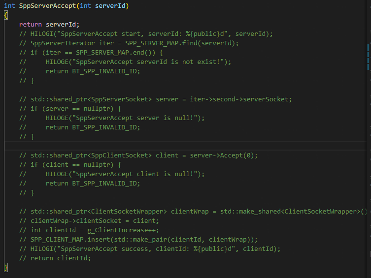

## 性能测试使用说明文档

​      本文档主要介绍了蓝牙专项测试程序的性能测试模块的功能使用说明。

### 性能测试界面

​       本程序的性能测试实现的是可以在点击一次"性能测试"按钮后，调用对应api实现一个较为简单的传数据的性能测试，并将所有返回值显示出来。各界面实现的是在连接情况下，在两台设备之间传数据，以此来计算传输数据的时间和速率性能。

#### 

#### 1. 经典蓝牙发现测试界面（ohos.bluetooth.d.ts）

​     速率测试：(测试一次，以求出蓝牙的发现时间)

稳定性测试：(设定为循环测试十次，以求平均的蓝牙发现时间)

​        进入界面后，点击"性能测试准备"按钮，调用ohos.bluetooth.d.ts中经典蓝牙类所需要的接口，测试顺序有一定的逻辑先后关系，自动完成性能测试前需要准备的操作如设置名称，模式等，会显示相应的调用传值结果。再点击"性能测试开始"按钮，开始性能测试，会搜索发现蓝牙设备，显示相应的发现结果。点击"结束"按钮，结束性能测试。保证可以重复正常进行性能测试。（也可以是多次扫描发现的稳定性性能测试）

#### 2. 经典蓝牙发现测试界面（ohos.bluetoothManager.d.ts）

​        进入界面后，点击"性能测试准备"按钮，调用ohos.bluetoothManager.d.ts中经典蓝牙类所需要的接口，测试顺序有一定的逻辑先后关系，自动完成性能测试前需要准备的操作如设置名称，模式等，会显示相应的调用传值结果。再点击"性能测试开始"按钮，开始性能测试，会搜索发现蓝牙设备，显示相应的发现结果。点击"结束"按钮，结束性能测试。保证可以重复正常进行性能测试。（也可以是多次扫描发现的稳定性性能测试）

#### 3. BLE蓝牙发现测试界面（ohos.bluetooth.d.ts）

速率测试：(测试一次，以求出BLE蓝牙的发现时间)

稳定性测试：(设定为循环测试十次，以求平均的BLE蓝牙发现时间)

​        进入界面后，点击"性能测试准备"按钮，调用ohos.bluetooth.d.ts中BLE类所需要的接口，测试顺序有一定的逻辑先后关系，自动完成性能测试前需要准备的操作如设置名称，模式等，会显示相应的调用传值结果。再点击"性能测试开始"按钮，开始性能测试，会搜索发现蓝牙设备，显示相应的发现结果。点击"结束"按钮，结束性能测试。保证可以重复正常进行性能测试。（也可以是多次扫描发现的稳定性性能测试）

#### 4. BLE蓝牙发现测试界面（ohos.bluetoothManager.d.ts）

​        进入界面后，点击"性能测试准备"按钮，调用ohos.bluetoothManager.d.ts中BLE类所需要的接口，测试顺序有一定的逻辑先后关系，自动完成性能测试前需要准备的操作如设置名称，模式等，会显示相应的调用传值结果。再点击"性能测试开始"按钮，开始性能测试，会搜索发现蓝牙设备，显示相应的发现结果。点击"结束"按钮，结束性能测试。保证可以重复正常进行性能测试。（也可以是多次扫描发现的稳定性性能测试）

**Gatt和Spp测试前需要先配对**

#### 5. Gatt速率测试界面（ohos.bluetooth.d.ts）

测试Gatt两端的收发信息变化的速率

Server端：

Client端：

因为softbus的拦截原因，Spp无法正常连接，故将softBus的SppServerAccept部分代码屏蔽掉。

~~~
路径为：foundation/communication/bluetooth/frameworks/inner/c_adapter/ohos_bt_spp.cpp
~~~

​       进入界面后，点击"性能测试准备"按钮，调用ohos.bluetooth.d.ts中Gatt类所需要的接口，测试顺序有一定的逻辑先后关系，自动完成性能测试前需要准备的操作如设置名称，模式等，会显示相应的调用传值结果。再点击"性能测试开始"按钮，开始性能测试，会在两台设备之间传输数据，显示相应的传输结果。点击"结束"按钮，结束性能测试。保证可以重复正常进行性能测试。

#### 6. GattManager速率测试界面（ohos.bluetoothManager.d.ts）

​        进入界面后，点击"性能测试准备"按钮，调用ohos.bluetoothManager.d.ts中Gatt类所需要的接口，测试顺序有一定的逻辑先后关系，自动完成性能测试前需要准备的操作如设置名称，模式等，会显示相应的调用传值结果。再点击"性能测试开始"按钮，开始性能测试，会在两台设备之间传输数据，显示相应的传输结果。点击"结束"按钮，结束性能测试。保证可以重复正常进行性能测试。

#### 7. Spp速率测试界面（ohos.bluetooth.d.ts）

测试Spp两端的收发信息的速率，循环100次，以求平均值

连接阶段：

- Client端：

- Server端：

写入读取阶段：

- Client端：

Server端：

​       进入界面后，点击"性能测试准备"按钮，调用ohos.bluetooth.d.ts中Spp类所需要的接口，测试顺序有一定的逻辑先后关系，自动完成性能测试前需要准备的操作如设置名称，模式等，会显示相应的调用传值结果。再点击"性能测试开始"按钮，开始性能测试，会在两台设备之间传输数据，显示相应的传输结果。点击"结束"按钮，结束性能测试。保证可以重复正常进行性能测试。

#### 8. SppManager速率测试界面（ohos.bluetoothManager.d.ts）

​        进入界面后，点击"性能测试准备"按钮，调用ohos.bluetoothManager.d.ts中Spp类所需要的接口，测试顺序有一定的逻辑先后关系，自动完成性能测试前需要准备的操作如设置名称，模式等，会显示相应的调用传值结果。再点击"性能测试开始"按钮，开始性能测试，会在两台设备之间传输数据，显示相应的传输结果。点击"结束"按钮，结束性能测试。保证可以重复正常进行性能测试。

#### 9. Spp带宽测试界面（ohos.bluetooth.d.ts）

测试Spp两端的收发信息的带宽，信息字节较大，以求发送的带宽大小。

Client端：

Server端：

​       进入界面后，点击"性能测试准备"按钮，调用ohos.bluetooth.d.ts中Spp类所需要的接口，测试顺序有一定的逻辑先后关系，自动完成性能测试前需要准备的操作如设置名称，模式等，会显示相应的调用传值结果。再点击"性能测试开始"按钮，开始性能测试，会在两台设备之间传输数据，显示相应的传输结果。点击"结束"按钮，结束性能测试。保证可以重复正常进行性能测试。

#### 10. SppManager带宽测试界面（ohos.bluetoothManager.d.ts）

​        进入界面后，点击"性能测试准备"按钮，调用ohos.bluetoothManager.d.ts中Spp类所需要的接口，测试顺序有一定的逻辑先后关系，自动完成性能测试前需要准备的操作如设置名称，模式等，会显示相应的调用传值结果。再点击"性能测试开始"按钮，开始性能测试，会在两台设备之间传输数据，显示相应的传输结果。点击"结束"按钮，结束性能测试。保证可以重复正常进行性能测试。